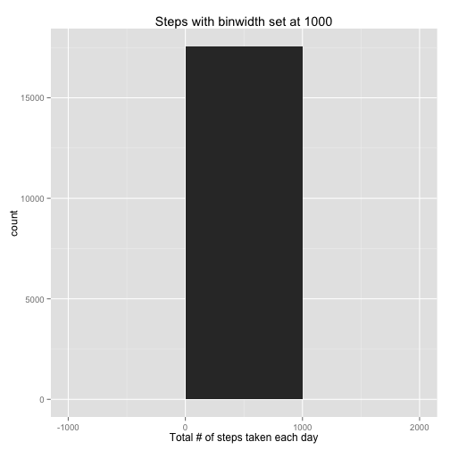
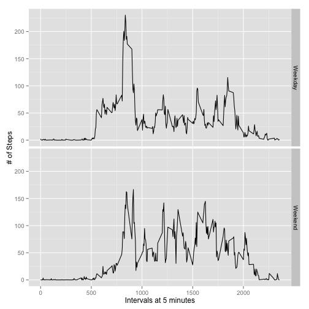

# Reproducible Research: Peer Assessment 1
Student Name: Sherri Verdugo, M.S.


## Loading and preprocessing the data
Step One: Load in the data

```r
df <- read.csv("activity.csv")
```
Step Two: Check the head of the data

```r
head(df)
```

```
##   steps       date interval
## 1    NA 2012-10-01        0
## 2    NA 2012-10-01        5
## 3    NA 2012-10-01       10
## 4    NA 2012-10-01       15
## 5    NA 2012-10-01       20
## 6    NA 2012-10-01       25
```


## What is mean total number of steps taken per day?
We have a few steps to take here. First, I like to plot the data. This time I am using qplot from the ggplot2 library. Make sure you have that installed. If you do not have it, be sure to use install.packages("ggplot2").

```r
library(ggplot2)
df.steps <- tapply(df$steps, df$date, Fun=sum, na.rm=True)
qplot(df.steps, binwidth=1000, xlab="Total # of steps taken each day",
      main="Steps with binwidth set at 1000")
```

 
The next step is to find the mean total number of steps per day.

```r
mean(df.steps, na.rm=TRUE)
```

```
## [1] 31
```

```r
median(df.steps, na.rm=TRUE)
```

```
## [1] 31
```
## What is the average daily activity pattern?
This time, we are looking at the average daily activity pattern. This means that we have to aggregate and then plot. Again, we are using the library (ggplot2)...make sure you have that installed.

```r
library(ggplot2)
df.averages <- aggregate(x=list(steps=df$steps), by=list(interval=df$interval), FUN=mean, na.rm=TRUE)
ggplot(data=df.averages, aes(x=interval, y=steps)) + geom_line() + xlab("Intervals set at 5 minutes") + ylab("Average of steps taken")
```

 

Further, on average for all days in the dataset df, the 5 minute intervals contains the following maximum number of steps:

```r
df.averages[which.max(df.averages$steps),]
```

```
##     interval steps
## 104      835 206.2
```
## Imputing missing values
This dataset has many missing values that are coded as NA. The very presence of the missing data may introduce what is known as bias into the data analysis process. We need to take care to address this and carefully impute the data using r. First we identify the number of missing items from the dataframe. Finally, we generate a table to identify the number of missing items in this dataset.


```r
df.missing <- is.na(df$steps)
table(df.missing)
```

```
## df.missing
## FALSE  TRUE 
## 15264  2304
```

We can replace the missing values with the mean value of the 5-minute intervals by using a function that is conditional on the is.na and number of steps. This was tricky as it took more time to run through various options of how to do this. 


```r
nafiller <- function(steps, interval){
  filler <- NA
  if (!is.na(steps))
    filler <- c(steps)
  else
    filler <- (df.averages[df.averages$interval==interval, "steps"])
  return(filler)
}
myfill.df <- df
myfill.df$steps <- mapply(nafiller, myfill.df$steps, myfill.df$interval)
```
Now we can look at what we have done so far by calling the object.

```r
head(myfill.df)
```

```
##     steps       date interval
## 1 1.71698 2012-10-01        0
## 2 0.33962 2012-10-01        5
## 3 0.13208 2012-10-01       10
## 4 0.15094 2012-10-01       15
## 5 0.07547 2012-10-01       20
## 6 2.09434 2012-10-01       25
```

The next thing we can do is utilize the histogram for visualization with the filled in data set. 

```r
myts <- tapply(myfill.df$steps, myfill.df$date, FUN=sum)
qplot(myts, binwidth=1000, xlab="Total Number of Steps per Day",main="Total Number of Steps per Day After Imputation")
```

 

```r
mean(myts)
```

```
## [1] 10766
```

```r
median(myts)
```

```
## [1] 10766
```
From the imputation process, we notice that the mean and median values are higher. One explanation is that in the original data with some days that have 'steps' with the value of NA for any 'interval'. That means that the numbre of steps wld have 0 values that are removed in the original histogram. After the imputation, the values of the mean and median increase.

## Are there differences in activity patterns between weekdays and weekends?
To do this step, we have to look at the day of the week for every single measurement in the data that we are analyzing. We will continue using our filled data (myfill.df) for the next portion of this assignment.

```r
week.identify <- function(date){
 day <- weekdays(date)
 if (day %in% c("Monday", "Tuesday", "Wednesday", "Thursday", "Friday"))
   return("Weekday")
 else if (day %in% c("Saturday", "Sunday"))
   return("Weekend")
 else
   stop("Invalid Date")
}  
myfill.df$date <- as.Date(myfill.df$date)
myfill.df$day <- sapply(myfill.df$date, FUN=week.identify)
```
Let's look at what we have so far for identifying the day of the week as a weekend or weekday. Is R smart enough to handle that? The answer is, yes.

```r
head(myfill.df$day)
```

```
## [1] "Weekday" "Weekday" "Weekday" "Weekday" "Weekday" "Weekday"
```

The next step for this is to visually explore the data that we created. The option that is used is the panel plot that contains the average number of steps taken on either weekends or weekdays. Do people take more steps on the weekends or the weekdays?

```r
avg <- aggregate(steps ~ interval + day, data=myfill.df, mean)
ggplot(avg, aes(interval, steps))+geom_line()+ facet_grid(day ~ .) + xlab("Intervals at 5 minutes") + ylab("# of Steps")
```

 
From the graph we see that weekday steps start out similar to the weekend steps. The difference is that more regular paterns occur in the weekend steps.
